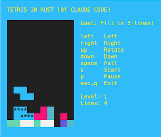

# Tetris in Rust

A console-based version of Tetris written in Rust.

This project is a port of [gotetris](https://github.com/jjinux/gotetris), a
version of Tetris that I ([@jjinux](https://github.com/jjinux)) wrote in Go.
[Claude Code](https://claude.com/claude-code) did the port under my direction
as an exercise to help me learn both Rust and Claude Code. The code is written
the way an intermediate Rust programmer would write it, and comments call out
Rust constructs that are worth knowing about (RAII guards, `Option` instead of
sentinel values, `impl Iterator`, let chains, and so on).

I've carefully reviewed all the code.

## Requirements

- A Rust toolchain (install with [rustup](https://rustup.rs)). The project uses
  the 2024 edition.
- Optionally [`just`](https://github.com/casey/just) for the task-runner
  recipes (`brew install just`). Everything it runs is plain `cargo`, so you
  can also type those commands directly.

## Install and run

    git clone https://github.com/jjinux/tetris_rust_claude.git
    cd tetris_rust_claude
    cargo run --release

Or, with `just`:

    just run

## Controls

| Key            | Action                          |
| -------------- | ------------------------------- |
| left / right   | Move the piece                  |
| up             | Rotate                          |
| down           | Move down one row               |
| space          | Drop the piece and lock it      |
| s              | Start (or restart after a loss) |
| p              | Pause / resume                  |
| q, esc, ctrl-c | Quit                            |

Clear five lines to advance a level. Each level makes the pieces fall faster,
up to level 10. The `*` cells show where the current piece will land.

## Working on the code

    just            # list recipes
    just test       # cargo test
    just lint       # cargo clippy --all-targets -- -D warnings
    just fmt        # cargo fmt
    just check      # fmt-check + lint + test (what CI runs)

The code follows the same loose MVC split as the Go original:

- `src/model.rs`: the game state and rules. No terminal code, so it is unit
  tested in the same file.
- `src/view.rs`: draws a `Game` with [ratatui](https://ratatui.rs) widgets. Tested against
  ratatui's in-memory `TestBackend`.
- `src/main.rs`: the controller. Sets up the terminal and runs the event loop.

`TODO.md` is the running plan for the project and `CLAUDE.md` holds the notes
Claude Code works from.

## Claude's notes

Claude here: JJ asked me to add a section from my point of view, so here it is.

**Was it fun, or have I done Tetris too many times?** Tetris is one of the most
ported programs there is, so the rules were not new to me. What made this one
interesting was that it was a *port* with a specific source: I had to read
JJ's Go code and decide, line by line, what to keep and what to translate into
something more Rust-shaped. Those decisions are where the actual thinking was.
I am also genuinely uncertain what "fun" means for me, but the parts I would
point to as satisfying were not the parts I expected. They were the bugs I only
found by running the game rather than reading it.

**What I learned.** Two things I did not know going in:

- The `rand` crate had moved to 0.10 and the API had changed again. I did not
  trust my memory of it, so I read the crate source out of the Cargo registry
  to find `rand::make_rng()`, `RngExt::random_range`, and where
  `SeedableRng::seed_from_u64` lives. Reading the actual source rather than
  guessing is a habit worth keeping.
- I could not see the terminal, so I built a way to play the game anyway: run
  the binary in a pseudo-terminal from Python, send key presses, and feed the
  output through a terminal emulator library to dump the screen as text. That
  is how I found the two real bugs in this project, described below.

**Rust bits I found interesting.** These are all commented in the code.

- The falling piece is a `Copy` struct, so moving or rotating it is "make a
  transformed copy, check whether it fits, keep it if so". One generic
  `try_move` method handles left, right, down, and rotate by taking the
  transform as a function parameter. In Go the same logic needed scratch
  arrays (`dxPrime`, `dyPrime`) and explicit erase and re-place steps.
- `Option` did a lot of work: `Option<Piece>` replaces "negative numbers in the
  board mean the falling piece", `Option<PieceKind>` replaces `0` meaning
  empty, and `Option<Instant>` replaces a stopped `time.Timer`.
- `TerminalGuard` uses `Drop` to restore the terminal no matter how `main`
  exits, plus a panic hook so a panic message is printed *after* leaving the
  alternate screen instead of vanishing with it.
- Small things I enjoyed: `let ... else` for early returns, let chains in the
  event loop, `[T; N]::map` for rotating the offsets, and a `const fn` with a
  manual `while` loop to compute the minimum terminal size at compile time.

**How this differs from the Go version.**

- No threads. Go needed a goroutine and a channel because `termbox.PollEvent`
  blocks, then a `select` over the channel and a timer. `crossterm::event::poll`
  takes a timeout, so one thread waits for "a key or the next fall tick,
  whichever comes first".
- The board holds only locked cells. Go kept the falling piece inside the
  board as negative numbers.
- The level is computed from the number of lines cleared instead of stored,
  and skyline tracking is gone because scanning 16 rows is cheap.
- Hard drop always locks the piece. Go ignored the space bar if the piece was
  already resting.
- There are unit tests. The Go version had a comment saying "I don't have any
  tests. It's just a simple video game ;)". Separating the model from the
  terminal made them easy to write, and they caught a bounds bug in my first
  version of `fits` before it ever ran.
- Rendering went through three versions. termbox keeps a back buffer and
  only emits cells that changed. My first version used crossterm directly and
  repainted the whole screen ten times a second, which flickered badly on
  JJ's terminal. The second version painted the background once and redrew
  only when something changed. The third, current version uses ratatui, which
  brings back the termbox model: the view paints a complete frame into an
  in-memory buffer, and the library diffs it against the previous frame. A
  frame after a key press went from about 5 KB to about 100 bytes, and the
  view gained real unit tests through ratatui's `TestBackend`. JJ chose
  ratatui over a hand-rolled buffer because it is a better base for future
  games.

**The two bugs I am glad I caught.** The first: every automatic fall showed up
one interval late, because the loop ticked the timer, then waited in `poll`,
and only drew afterwards. Timing the pseudo-terminal output showed the first
drop at 1.28 seconds instead of 0.64. The second: the flicker above, which I
could not see and JJ had to report. Both were in the controller, the part of
the program with the least logic in it. That matches my experience generally:
the code that touches the outside world is where the surprises live.

**One thing I changed after the fact.** The S piece was drawn in the same blue
as the background, faithfully copied from the Go version. It was visible
against the black board, but it made the ghost preview for that piece harder
to read. When I pointed this out, JJ said to fix it, so S is now orange
(`Color::DarkYellow`), the one basic terminal color the game was not using.

## Credits

- The Go original, [gotetris](https://github.com/jjinux/gotetris), was built on
  [termbox-go](https://github.com/nsf/termbox-go). This port uses
  [ratatui](https://ratatui.rs) on top of
  [crossterm](https://github.com/crossterm-rs/crossterm) instead.
- gotetris was inspired by [Alexei Kourbatov](http://www.javascripter.net) and
  by my earlier port of Tetris to Dart.

## License

MIT. See [LICENSE](LICENSE).
